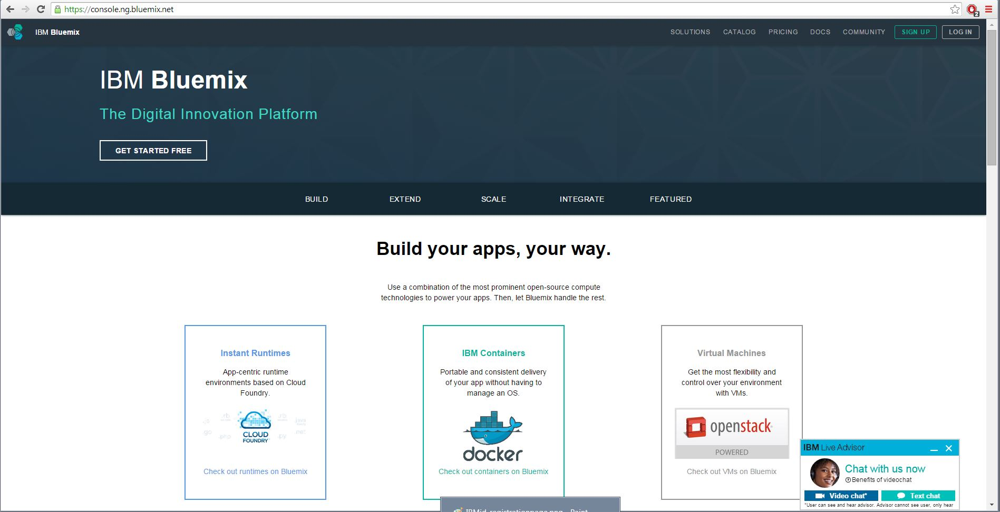

# Training 2015 Documentation

Hey there, lets first setup some IBM accounts and then get your laptop ready for development life.

You will not have Wi-Fi on your laptop until we set that up later. 
For the time being take an ethernet cord on your desk and plug into your laptop and one of the jacks behind your desk. 
Only one of the jacks works and it should be the top left one. 


## 0. Signing up and Registering for Required Accounts

This section will help you obtain the usernames and passwords you need for the various IBM services that are required for this training.

## 0.1. Get an IBM ID  

* Go to [IBM ID Registration page](https://www.ibm.com/account/profile/us?page=reg) and Submit the registration form


* Once registered, you should see the following


## 0.2. Sign-up for IBM Bluemix

* Go to [Bluemix Homepage](https://console.ng.bluemix.net/) and click on Sign Up


* On the following page, click on "Already have an IBM id?"


* Fill the form on the page and submit


* Once submitted, you should see the following screen


* You should receive an email. Click on "Validate Email Address".


* You can login on Bluemix using your IBM ID from the [Bluemix Homepage](https://console.ng.bluemix.net/). Once logged in, you should see the dashboard.


## 1. Install Command Line Tools

This section walks you through installation of Git, Node.js, and the Cloud Foundry command-line client.  These are the command-line tools necessary to complete the training.

### 1.1.Git.  

* [Download](http://git-scm.com/downloads) the appropriate version for your operating system.


* Run the installer.  It's typically OK to accept the default options.
* Open a command prompt on your operating system and type `git version`. Note that on Windows you will want to open `Git BASH` from the start menu.  You should see a response that's similar to the following:

```
git version 1.9.5 (Apple Git-50.3)
```

Although it will probably contain your operating system name in the parenthesis.

## 1.2.  Node.Js

* Download and install the [Node.js Binaries](https://nodejs.org/en/).

* After its installed test it by opening a command prompt on your operating system
	- To open a command prompt on windows open the start menu and type `cmd` then hit enter

* Type node -v.  Node should respond in kind:

```
> node -v
v4.4.5
```

* If you get output very similar to the above, you have successfully installed Node.js.
* Close your command prompt.

## 1.3. Cloud Foundry CLI

* [Download the Cloud Foundry CLI Installer](https://github.com/cloudfoundry/cli) for your operating system and save it to a directory you can remember. **NOTE**: Scroll down to the `Downloads` section on the previous link to find the `Stable Installer` for your operating system!
* Double-click the file you have downloaded and execute the installer.
* We recommend the default installation location.
* Next, open a command prompt on your operating system.
* To check that the tool is properly installed, type `cf` at the prompt and press enter.  You should get a long list of command line options as shown below.


* Now you will want to target Bluemix as shown in this code block:

```
C:\> cf api https://api.ng.bluemix.net
Setting api endpoint to https://api.ng.bluemix.net...
OK

                   
API endpoint:   https://api.ng.bluemix.net (API version: 2.23.0)   
Not logged in. Use 'cf login' to log in.
```

* And login, as shown here:

```
C:\> cf login
API endpoint: https://api.ng.bluemix.net

Email> benjsmi@us.ibm.com

Password> 
Authenticating...
OK

Select an org (or press enter to skip):
1. benjsmi@us.ibm.com

Org> 1
Targeted org benjsmi@us.ibm.com

Select a space (or press enter to skip):
1. dev

Space> 1
Targeted space dev
                   
API endpoint:   https://api.ng.bluemix.net (API version: 2.23.0)   
User:           benjsmi@us.ibm.com   
Org:            benjsmi@us.ibm.com   
Space:          dev  
```

It's not a problem if you do not get the option to choose an org or space, so long as once you are logged in, your `User` and `Org` lines match your IBM ID as shown in the last lines above.

## 1.4 GoLang
Chaincode is written in GoLang. You will be building Go code locally to make sure it compiles.  Therefore setup GoLang on your laptop.
- Download and install GoLang https://golang.org/ 
- Next [check your install](https://golang.org/doc/install#testing) (only follow the "Test your installation" section)

## 1.5 IDE
You are going to need an editor to develop in.  It you do not have a favorite already then I'd recommend Visual Studio Code.
For Node.js it is awesome, and for most other things its pretty decent. 
- Download and install [Visual Studio Code](https://code.visualstudio.com/)
- Get the Go extension by:
	- open VSCode, press and hold "ctrl" + "p"
	- type "ext install Go"

##2.0 Test Email
- Make sure your Lotus Notes works.  This is IBM's everything client.  You will use it for email + instant messaging.
	- Send a test email to dshuffma@us.ibm.com with your name and cell phone number. I will only use your number when I cannot find you physically.  It’s also important to send David or Mihir an email or txt message if there is any reason you cannot come into work today or must head home early.


##2.1 Slack
- We use Slack and IBM Sametime for instant messaging.  Sametime is already setup on your laptop. Go setup Slack on your laptop and join our team at https://etilabs.slack.com . 
	- Join the channel #operatives
	- You will need to login either Sametime or Slack whenever you are at work
		- This will be our primary way to reach you.  Alternatively, we may just scream your name until you appear.
	- This is a free Slack team, so do not send any code/files over it and try not to leak project passwords or nuclear launch codes.
	
##3.0 Wi-Fi 
- Our Wi-Fi is super complicated to setup. Make sure you are well rested and hydrated before continuing. 


1. Open Firefox as an admin 
	- Open the start menu
	- Type Firefox, right click the Mozilla Firefox program
	- Select "Run as administrator"
2. Follow the official instructions here but use the Firefox browser we just opened. Good luck. https://w3-01.ibm.com/helpcentral/Content/View/d6a33202-c082-4f55-969d-fcb2f28ea3b5/automated_ibm_digital_certificate_setup_for_windows_7
1. If it all went well, unplug the ethernet cord and place it ontop of the black cabinet near David

***
#Learn
First up lets learn about blockchain basics. 

##Links to reference:
Below is several links that you should bookmark. 

1. [Glossary](https://github.com/hyperledger/fabric/blob/master/docs/glossary.md?cm_mc_uid=73007780379114621195867&cm_mc_sid_50200000=1464373552) - confused on a term, look it up here
1. [Production Bluemix](https://console.ng.bluemix.net/)
1. [Staging Bluemix](https://console.stage1.ng.bluemix.net/)
1. [Hyperledger REST API Documentation Doc](https://github.com/hyperledger/fabric/blob/master/docs/API/CoreAPI.md#chaincode) - markdown version
1. [Hyperledger REST API Documentation Swagger](https://obc-service-broker-staging.stage1.mybluemix.net/swagger) - interactive version
1. [Hyperledger Docs Table of Contents](https://github.com/hyperledger/fabric/tree/master/docs)

##Links to Read:
Read the links below to understand blockchain and your role. 

1. [What is blockchain](https://www.ibm.com/blockchain/what_is_blockchain.html)
2. [What can blockchain do](https://www.ibm.com/blockchain/what_can_blockchain_do_for_you.html)
3. [Chaincode FAQ](https://github.com/hyperledger/fabric/blob/master/docs/FAQ/chaincode_FAQ.md)
4. [Confidentiality FAQ](https://github.com/hyperledger/fabric/blob/master/docs/FAQ/confidentiality_FAQ.md)

##Links to Watch:
5. [Bitcoin Videos](https://www.khanacademy.org/economics-finance-domain/core-finance/money-and-banking/bitcoin/v/bitcoin-what-is-it) - extra, will likely be helpful but keep in mind that Bitcoin is different in many ways from IBM Blockchain
1. [IBM Blockchain Bluemix Service](https://www.youtube.com/embed/kuMmFfRkbaE)

***
#Demos
Ok you are done with setup! Now lets get experience. 
Try each demo in order. 
This is may look like the smallest section but it should take far longer then any other section. 
Take your time here and ping us with questions/concerns/stuckness. 

1. Run through [learn-chaincode](https://github.com/IBM-Blockchain/learn-chaincode) - this is a quick intro into how to write chaincode
	- protip build the chaincode locally before deploying
1. Run through [marbles tutorial 1](https://github.com/IBM-Blockchain/marbles/blob/master/tutorial_part1.md) choose the **"Manual Network Setup"** and **"Run Marbles on Local Machine"** - its a very simple asset trading example
1. Run through [marbles tutorial 2](https://github.com/IBM-Blockchain/marbles/blob/master/tutorial_part2.md) - still a very simple asset trading example

#Explore the Bluemix IBM Blockchain Service
The last thing you should see before going off into the wild is the IBM Blockchain Service Dashboard. 
The various tutorials may have pointed you to this at times, but lets fill in any gaps of what it can do. 

1. First login to [Bluemix](https://console.ng.bluemix.net)
1. Click the "Catalog" link on the top navigation bar


1. Find and click the "Blockchain" tile (you can use the navigation on the left to filter the list: Services > Network)


1. Choose any space from the "Space:" dropdown (dealers choice)
1. Leave the "App:" field as "Leave unbound" (unless you already have an application, but you probably don't yet)
1. Change the "Service name" to "myblockchain" without the quotes
1. Leave the "Credential name" field as its default value
1. Leave the "Selected Plan" as its default value
1. Click the "CREATE" button


1. If all goes well you should be on the manage screen for your new service. Click the "LAUNCH" button to see the dashboard for your network. 
	- You should see a few peers listed in the first table
	- from here you can monitor if your peers crash, if the chaincode containers are running, and view logs for all


(Note if you find yourself on the Bluemix Dashboard and want to get back to this service screen just click the tile name "myblockchain" in the "Services" section)

The network is all setup. You are now on your blockchain's dashboard.


1. Network Tab - This is the 'home' of the service
	- The top table contains the running peers and their status
	- The bottom table contains a list of running chaincodes
	- Both tables will update periodically
	- The log like icon will open up a static log file for the peer/chaincode.  This is very handy for debugging

1. Deploy Tab - Let’s get some chaincode into this bbb...bbllockchain. 
	- On the deploy tab we have chaincode examples. 
	- Select "Example02" from the drop down and click the giant "Deploy" button
	- Wait for the dancing rectangles to finish their ceremony. 
		- In the meantime click the "Show API details" checkbox to see the REST call details, uncheck again to hide these details
	- Next click the "Query A" button and then "Query B" button and note the values that get printed out
	- Next click the "Transfer from A to B" button
	- Finally click the "Query A" and "Query B" buttons to see the new values
	- Click the "Chaincode" link under the "Links" column for Example02
		- Explore the chaincode until you find the code responsible for transfering an amount from A to B
	- That’s it for this tab. Play with the other examples or this one some more.
	
1. Blockchain Tab - Now that we have some chaincode deployed go to the "Blockchain" tab
	- You should see at least 3 blocks and some basic stats about the network
	- Click the blocks to see details about the block in the table

1. APIs Tab - Jump to the APIs tab.
	- Click the "Blockchain" section
	- Click the "Try it out!" button
	- It should return with details about the blockchain network including things like its block height
	

***
You are now ready. Go forth and code.